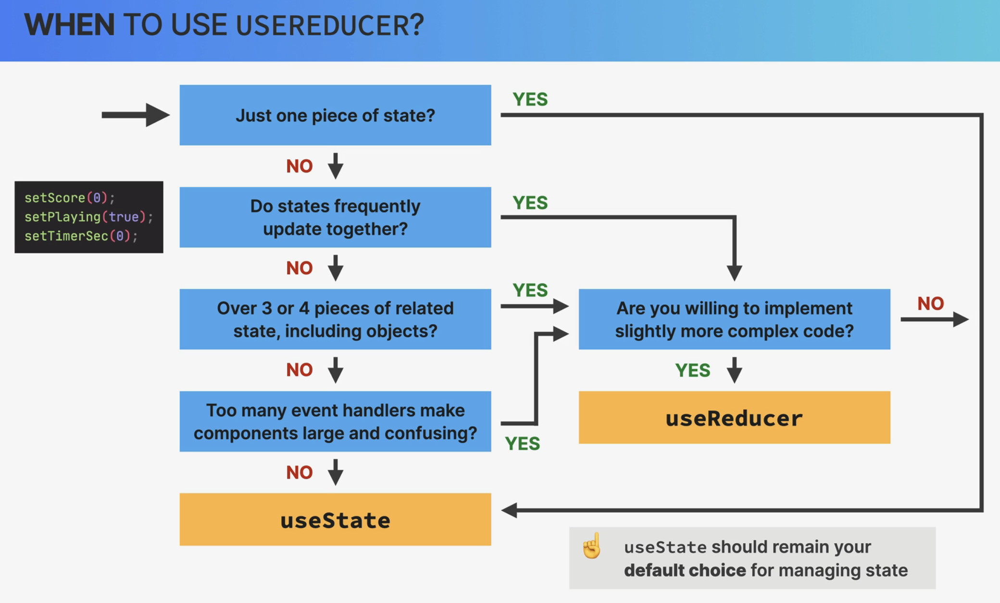

# Working With Complex State

## Table of Contents

1. [A Look at useReducer Hook](#a-look-at-usereducer-hook)
2. [Summary: useState vs. useReducer Hook](#summary-usestate-vs-usereducer-hook)

## A Look at useReducer Hook

The useReducer hook in React is an alternative to useState for managing more complex state logic. It takes a **reducer function** and an **initial state**, and returns the current state and a dispatch function to trigger state updates.

A reducer function defines how the state should change in response to actions, which are dispatched.

Here's a succinct example using `useReducer` hook in React:

```jsx
import React, { useReducer } from "react";

const initialState = { count: 0 };

function reducer(state, action) {
  switch (action.type) {
    case "increment":
      return { count: state.count + 1 };
    case "decrement":
      return { count: state.count - 1 };
    default:
      return state;
  }
}

const Counter = () => {
  const [state, dispatch] = useReducer(reducer, initialState);

  return (
    <div>
      <p>Count: {state.count}</p>
      <button onClick={() => dispatch({ type: "increment" })}>+</button>
      <button onClick={() => dispatch({ type: "decrement" })}>-</button>
    </div>
  );
};

export default Greeting;
```

### Explanation:

- `reducer`: Defines how state changes based on action types (`increment`, `decrement`).
- `useReducer`: Returns the current state and a `dispatch` function.
- `dispatch`: Triggers state changes by passing an action object (e.g., `{ type: 'increment' }`).

Use useReducer for more complex state management, especially when state updates depend on previous states or involve multiple actions.

## Summary: useState vs. useReducer Hook


